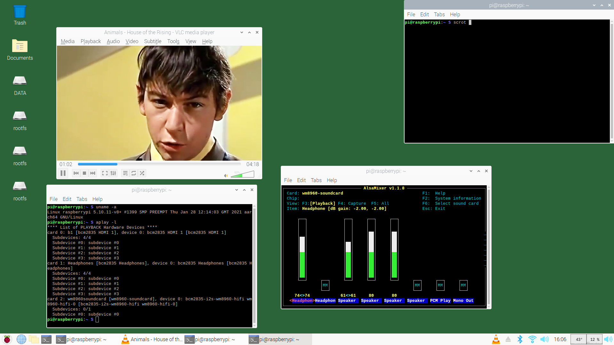

# RaspberryPi-GPIO-Audio
Audio DAC interfaced through Raspberry Pi GPIO such as i2s

### WM8960 Wolfson Audio DAC

[**Waveshare WM8960 Play/Record Audio Hat**](https://www.waveshare.com/wm8960-audio-hat.htm) with a [**Wiki**](https://www.waveshare.com/wiki/WM8960_Audio_HAT) and a [**Github repository**](https://github.com/waveshare/WM8960-Audio-HAT/).

An ALSA capabilities script indicates this DAC to perform up to 32bit audio resolution at a 384kHZ sampling rate - see [**alsa-capabilties**](ReSpeaker2MicsPiHAT/alsa-capabilities.txt) card 4.

<p align="left">
  
 
<br>
  
  
### Instructions for kernel 5.15.xx (2022)

Currently (May 2022) there are two different ways to install the wm8960 soundcard on the new 5.15 kernel - both methods work well with pulseaudio and/or alsa. For a combination of the waveshare (Dr-Ni April version) and seeed drivers (HinTak version) refer to [**this posting**](https://github.com/waveshare/WM8960-Audio-HAT/issues/44#issuecomment-1113349654). This combo method was tried and also yields a noise-free functional pulseaudio and alsa wm8960 sound device - refer to [**install-combo**](install-combo.txt) for the details of the installation.
  
*It is advisable to power-cycle the Raspberry Pi after installation of the sound driver - a reboot may not be enough.*

**Install 1 - Use the new 1 May 2022 Waveshare Drivers:**
```
git clone https://github.com/waveshare/WM8960-Audio-HAT
cd WM8960-Audio-HAT
sudo ./install.sh
sudo reboot
```
After the reboot aplay -l should show the wm8960 soundcard. If present, ignore the message "failed to load i2s-mmap" - it does load from config.txt and it is required.

**Install 2 - Install using the [Seeed Voicecard](https://www.seeedstudio.com/ReSpeaker-2-Mics-Pi-HAT.html) Drivers**
  
To [**install**](https://github.com/HinTak/seeed-voicecard) first uninstall the waveshare WM8960 driver and reboot then delete the old WM8960-Audio-HAT folder. (It is better to remove power from the Raspberry Pi and HAT completely before installing these drivers.) For more details about this HAT look [**here**](https://github.com/TobiasVanDyk/RaspberryPi-GPIO-Audio/tree/master/ReSpeaker2MicsPiHAT) or [**here**](https://www.seeedstudio.com/ReSpeaker-2-Mics-Pi-HAT.html). This driver also works without any adjustments to audio settings (i.e. works with both pulseaudio and alsa without distortion or noise).
  
```
git clone https://github.com/HinTak/seeed-voicecard
cd seeed-voicecard
sudo ./install.sh
sudo reboot
```
**This seeed install also [works](64bit-kernel-515xx/) on the 64bit kernel-5,15.xx. You may want to change kernel.img to kernel8.img in the install.sh but it is not necessary.**

If you use headphones as the primary output, use pavucontrol (sudo apt install pavucontrol), run it then and select wm8960-headphones instead of the wm8960-speaker, and adjust the neadphone volume to above 0. This will make the headphone level sticky.
  
For the troubleshooting with an alsa-only settings, see the screenshot below [**First to Eleven's cover of Boulevard of Broken Dreams by Green Day**](https://www.youtube.com/watch?v=ilLTcTXTI0E)
<p align="left">
  
<br>
  
  
### Instructions for kernel 5.10.xx (2021)

If the wm8960 waveshare driver is already installed then uninstall it before updating the kernel to 5.10.11:
```
cd WM8960-Audio-HAT
sudo ./uninstall.sh
sudo reboot

```
Update to the new kernel, reboot and then delete the user folder WM8960-Audio-HAT if it exists. After the github clone as below, but before doing the install, 
[**download the modified wm8960.c**](https://github.com/Sybility/WM8960-Audio-HAT) from the Sybility WM8960-Audio-HAT github, and use as a replacement for the same file in the new WM8960-Audio-HAT folder. For more information about this file read about the wm8960 kernel 5.10 issues [**here**](https://github.com/waveshare/WM8960-Audio-HAT/issues/24) and [**here**](https://github.com/waveshare/WM8960-Audio-HAT/issues/23). The modified [**wm8960.c**](wm8960.c) has also been copied to this github.
```
git clone https://github.com/waveshare/WM8960-Audio-HAT
cd WM8960-Audio-HAT
sudo ./install.sh
sudo reboot

```
Run alsamixer, press F6, select wm8960 audio, and check that the headphone volume is not 0 (if you are using that instead of the speaker output). 

**64bit kernel 5.10.11** Starting with the Aug 2020 Raspi OS 64 bit, which was then updated to kernel 5.10.11.v8+ (sudo apt full-upgrade), it also yielded a fully working WM8960 HAT using the compile method as above. All the configuration files and overlays are in the 64bit folder.

<p align="left">
  
 
   
<br>

### Instructions for kernel 5.4.xx (2020)

**Method A:** Start with last released raspios install image 2020-05-27-raspios-buster-full-armhf.img, then update it fully: sudo apt-get update, sudo apt-get upgrade -y, or whatever method you are used to. You will then end with a 5.45x kernel. Then do Step 1 and 2.

**Method B:** Start with last released raspios install image 2020-05-27-raspios-buster-full-armhf.img, then do Step 1 which will do a kernel upgrade as well. Use Step 2 to check if the WM8960 driver is installed, if not repeat Step 1 without a cleanup or uninstall - i.e start with sudo ./install.sh. Reboot and check again. I had to do this twice for one of the installs - refer to this [**issue**](https://github.com/waveshare/WM8960-Audio-HAT/issues/10). 

**Step 1:**
```
git clone https://github.com/waveshare/WM8960-Audio-HAT
cd WM8960-Audio-HAT
sudo ./install.sh
sudo reboot

```
**Step 2:**
After reboot check if audio device has been installed with aplay -l, which should list the wm8960 device as card 1 or 2.
You can then follow the instructions at the [**Sparkfun WM8960 setup for alsa**](https://learn.sparkfun.com/tutorials/sparkfun-top-phat-hookup-guide/wm8690-audio-codec).
```
sudo alsamixer
sudo nano /usr/share/alsa/alsa.conf
sudo alsamixer

```
The result is something like shown below - remember to select the wm8960 audio device and mixer in vlcplayer (or audacious) and either the headphone or speaker as the mixer element.

<p align="left">
  
 
   
<br>
  
[**Waveshare WM8960 Stereo CODEC General purpose module**](https://www.waveshare.com/wm8960-audio-board.htm)
<p align="left">
  
 
 
<br>
 
 [**Raspberry Pi and Waveshare WM8960 Stereo CODEC General purpose module**](https://www.waveshare.com/wm8960-audio-board.htm)
<p align="left">
  
 
<br>

The WM8960 CODEC is also used by the [**Seeed voicecard**](https://github.com/respeaker/seeed-voicecard) or [**ReSpeaker 2-Mics Pi HAT**](https://wiki.seeedstudio.com/ReSpeaker_2_Mics_Pi_HAT/).
<p align="left">
  
 
   
<br
    
The [**Makerfabs**](https://www.makerfabs.com/voice-interaction-hat-for-raspberry-pi.html) [**Raspi-Voice-Interaction-Hat**](https://github.com/Makerfabs/Raspi-Voice-Interaction-Hat) also uses the WM8960 codec.
<p align="left">
  
  
<br    
