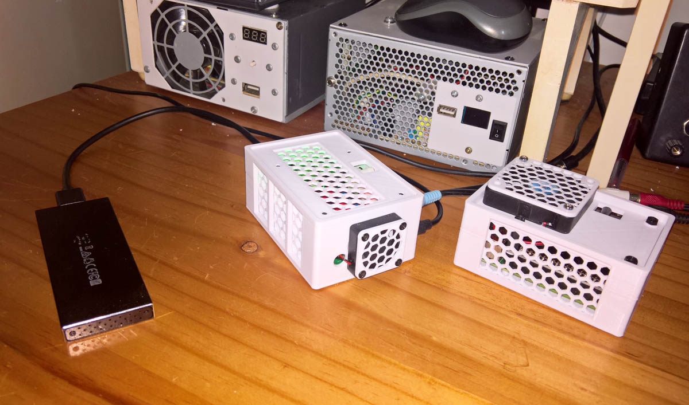
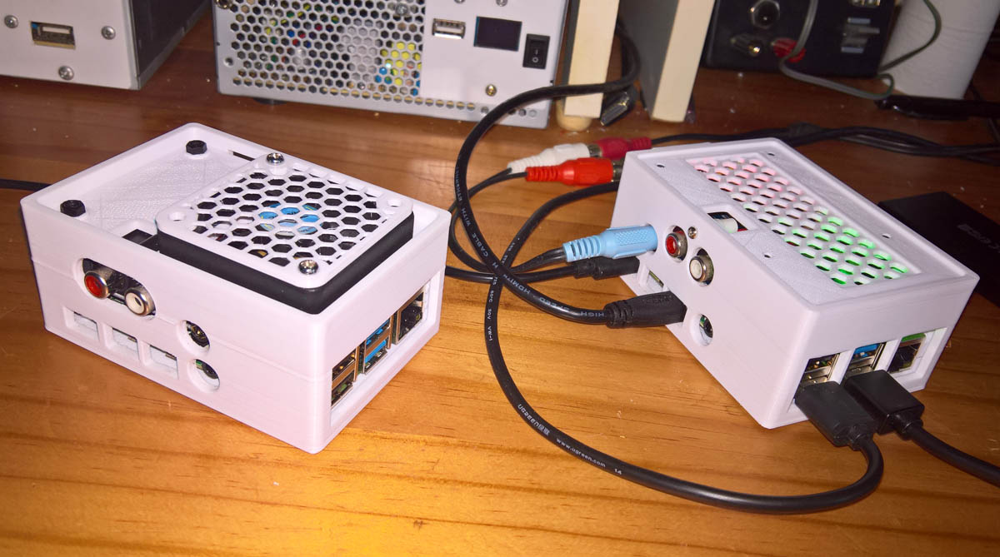
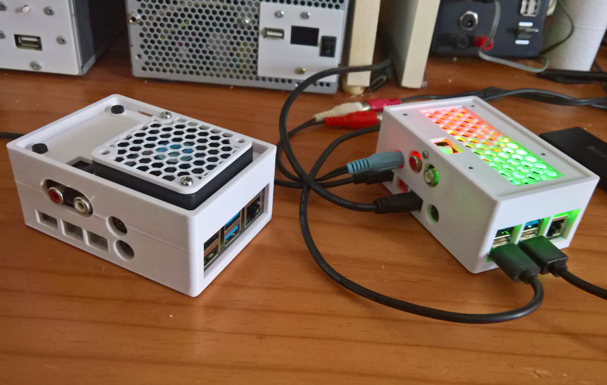
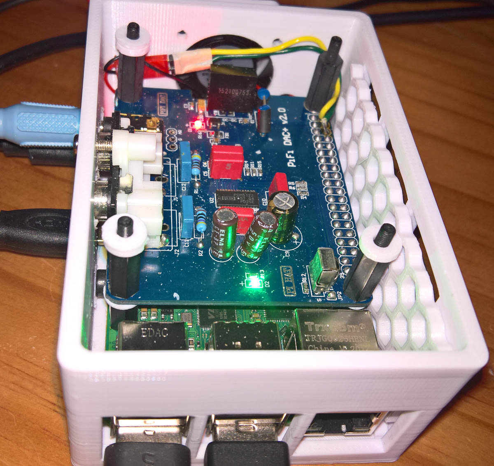
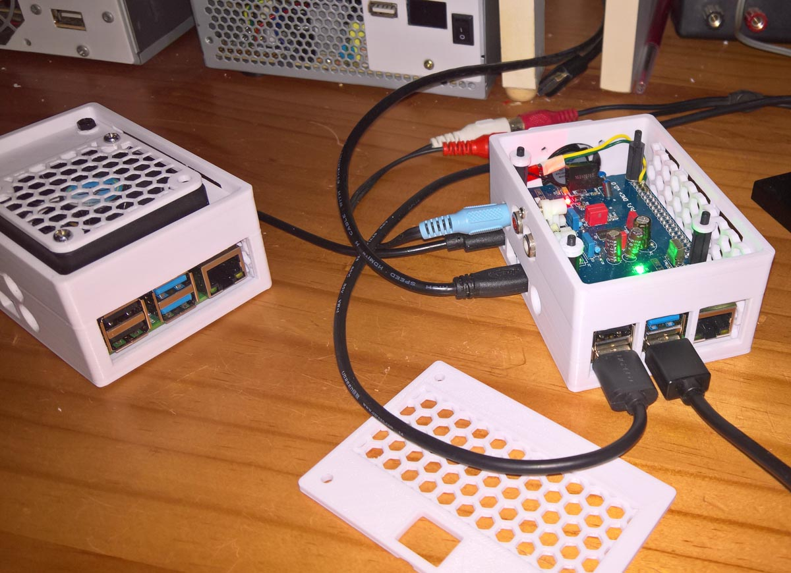
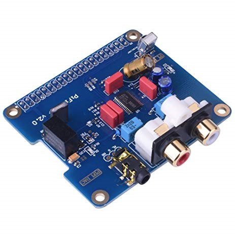
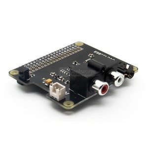

# Raspberry-Pi-Audio-DAC-Cases

  
   

Two fan-cooled Raspberry Pi 4B cases with two different audio DAC hats, had been 3d-printed. The cases, fan covers, and honeycomb mesh patterns, are sourced from:

[**Fan Grill Covers**](https://www.thingiverse.com/thing:2802474) - Creative Commons - Attribution - Non-Commercial - Share Alike license.

[**Honeycomb mesh**](https://www.thingiverse.com/thing:1701435) - GNU - GPL license and CC.

[**Raspberry Pi 4 Case**](https://www.thingiverse.com/thing:4859828) - [**also here**](model/Case.stl) - Creative Commons with Attribution license.

The RPi4 case above had been modified [**1**](model/Case1.stl) and [**2**](model/BlankCase.stl) and [**3**](model/BlankCase2.stl), so that (allmost) any DAC hat can be fitted. This was used, after drilling the three extra holes, for the second PCM5122 DAC. The first DAC case housed the ESS DAC without any modifications. Additional openings had also been added and the top covers modified.

The [**PCM5122 PiFi DAC+**](https://www.seeedstudio.com/Raspberry-pi-B-2B-HIFI-DAC-p-2801.html) is an inexpensive substitute for the HiFi Berry Pi DAC+ Hat and can be configured in exactly the same way - replace the line dtparam=audio=on from /boot/config.txt if with dtoverlay=hifiberry-dacplus.

The other DAC is an [**ESS ES9023**](http://www.suptronics.com/miniPCkits/x900.html) Sabre 24-bit/192kHz DAC and is configured by replacing the line dtparam=audio=on from /boot/config.txt if with dtoverlay=hifiberry-dac. 

The two audio DAC hats are also used [**here**](https://github.com/TobiasVanDyk/Teensy4-USB-Audio-DAC-and-Volume-Control) and  [**here**](https://github.com/TobiasVanDyk/Raspberry-Pi-PC-PSU-Desktop-Computer-with-a-Hard-Disk-Drive-and-Fan-and-Switch/edit/master/Readme.md) (at the very bottom).

All the modelling variations/customisation were made using [**OpenSCAD**](https://openscad.org/) and [**TinkerCAD**](https://www.tinkercad.com/).

The cases were printed using PLA (with no post-print finishing) using a [**Creality CR-20 Pro 3D-printer**](https://3dprinterly.com/3d-printer-cr-20-pro-specifications-features-and-benefits/).

The two Pi DACs were used with two 7" inch LCD displays and 3D printed cases for type C and H **Waveshare 7 inch displays** were printed. These are 7 inch LCD HDMI 1024x600 IPS and QLED displays: [**type (C)**](https://www.waveshare.com/7inch-hdmi-lcd-c.htm) and [**type (H**](https://www.waveshare.com/7hp-capqled.htm). These were based on the [**design here**](https://www.thingiverse.com/thing:3743598), and the front and back STL files are here in the folder [model](/model).

  
  
  

  
    

